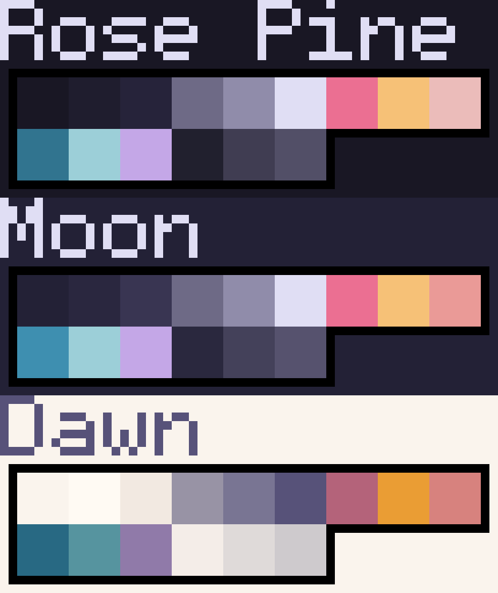

    
    <h2 align="center">Rosé Pine for Piskel</h2>

All natural pine, faux fur and a bit of soho vibes for the classy minimalist

## Usage

1. Open Piskel
2. Create a new palette
3. Select `Import from file` at the top
4. Import a rose pine palette file
5. Create to your heart's desire

## Gallery

## Thanks to

- [Smolder](https://github.com/smolderdev)
